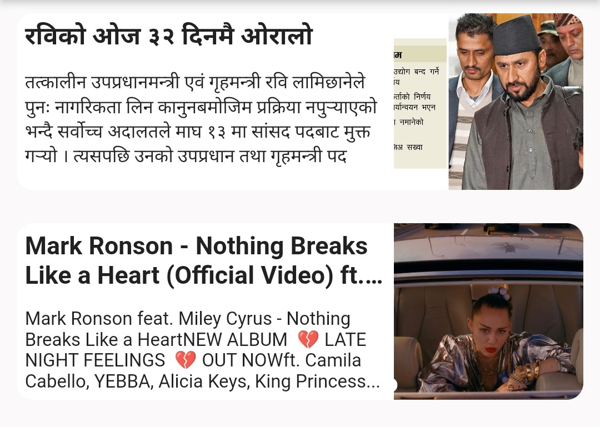
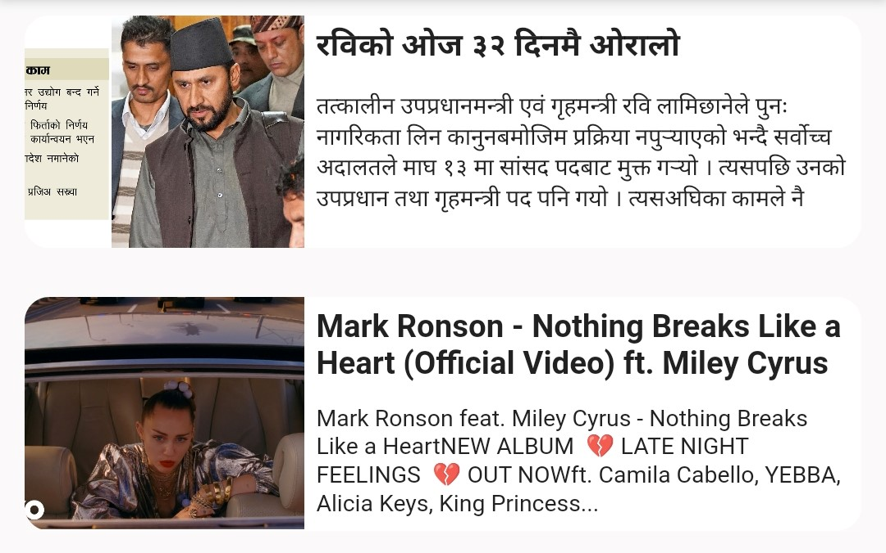
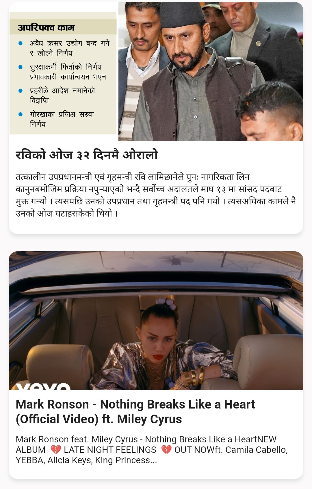
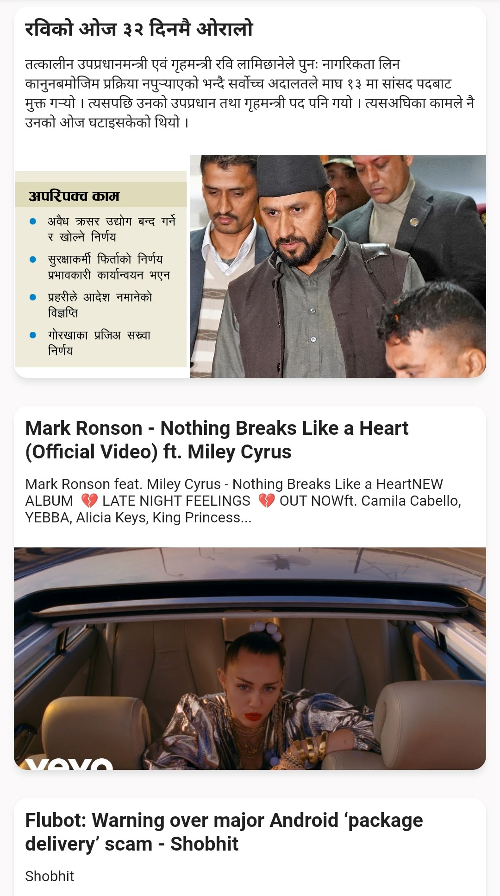

# Neplox LinkPreviewer
##### URL Preview and Meta Data:
##
[](https://app.travis-ci.com/starbibek/neplox_linkpreviewer.svg?branch=master)


A flutter package which will help you to show preview of the web url's with beautiful customizable design.

# Neplox LinkPreviewer: Preview Directions

## RTL


## LTR


## TOP


## BOTTOM

**If you like Show some ❤️ and star the repo to support the project**
## Installation

```Dart
flutter pub add neplox_linkpreviewer
```
# Usage
```Dart
import 'package:neplox_linkpreviewer/neplox_linkpreviewer.dart';
````
```Dart
class LinkPreviwer extends StatefulWidget {
  const LinkPreviwer({super.key, required this.url});
  final String url;

  @override
  State<LinkPreviwer> createState() => _LinkPreviwerState();
}

class _LinkPreviwerState extends State<LinkPreviwer> {
  @override
  Widget build(BuildContext context) {
    return Padding(
      padding: const EdgeInsets.all(10.0),
      child: NeploxLinkPreviewer(
        url: widget.url,
        linkPreviewOptions: NLinkPreviewOptions(
            urlContentType: NURLContentType.video,
            urlLaunch: NURLLaunch.enable,
            urlLaunchIn: NURLLaunchIn.browser,
            thumbnailPreviewDirection: NThumbnailPreviewDirection.bottom),
      ),
    );
  }
}

```

## MIT License
```
Copyright (c) 2023 Shobhit paudel

Permission is hereby granted, free of charge, to any person obtaining a copy
of this software and associated documentation files (the 'Software'), to deal
in the Software without restriction, including without limitation the rights
to use, copy, modify, merge, publish, distribute, sublicense, and/or sell
copies of the Software, and to permit persons to whom the Software is
furnished to do so, subject to the following conditions:

The above copyright notice and this permission notice shall be included in all
copies or substantial portions of the Software.

THE SOFTWARE IS PROVIDED 'AS IS', WITHOUT WARRANTY OF ANY KIND, EXPRESS OR
IMPLIED, INCLUDING BUT NOT LIMITED TO THE WARRANTIES OF MERCHANTABILITY,
FITNESS FOR A PARTICULAR PURPOSE AND NONINFRINGEMENT. IN NO EVENT SHALL THE
AUTHORS OR COPYRIGHT HOLDERS BE LIABLE FOR ANY CLAIM, DAMAGES OR OTHER
LIABILITY, WHETHER IN AN ACTION OF CONTRACT, TORT OR OTHERWISE, ARISING FROM,
OUT OF OR IN CONNECTION WITH THE SOFTWARE OR THE USE OR OTHER DEALINGS IN THE
SOFTWARE.
```


